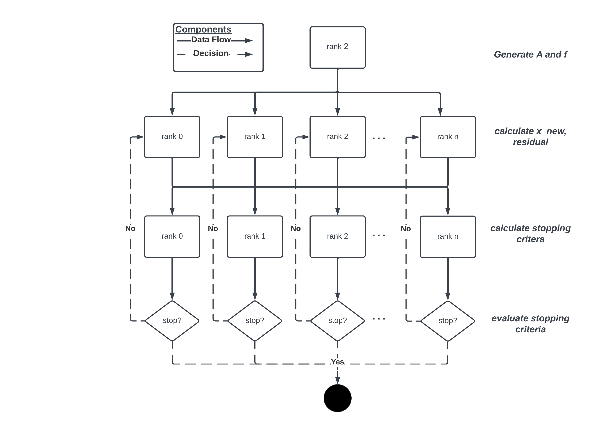
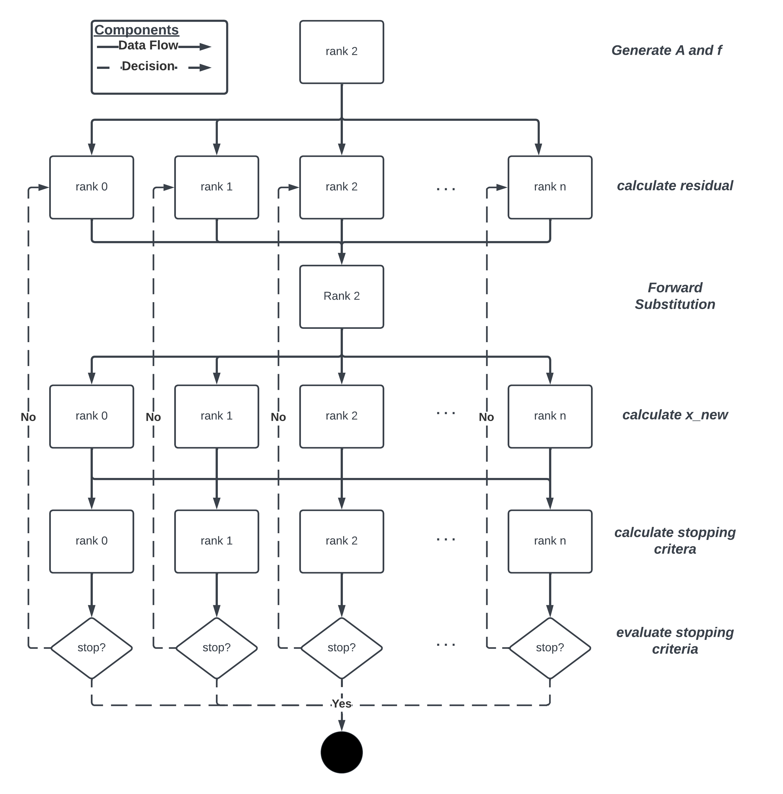

# Racing to Convergence - Comparing Parallel Speedup of Damped Jacobi and Gauss-Seidel Methods
This project was created for the numerical training course at the Faculty of Mathematics at the University of Zurich. The intent was to compare the speedup and efficiency of iterative solvers, namely damped Jacobi and Gauss-Seidel when implemented in parallel. The project was implemented in C/C++ using the MPI library. For further details, check out the corresponding paper and presentation [here](docs/).

## Results

### Parallel Damped Jacobi

### Parallel Gauss-Seidel

### Five-Point Formula
TODO

### L2-Projection
TODO
